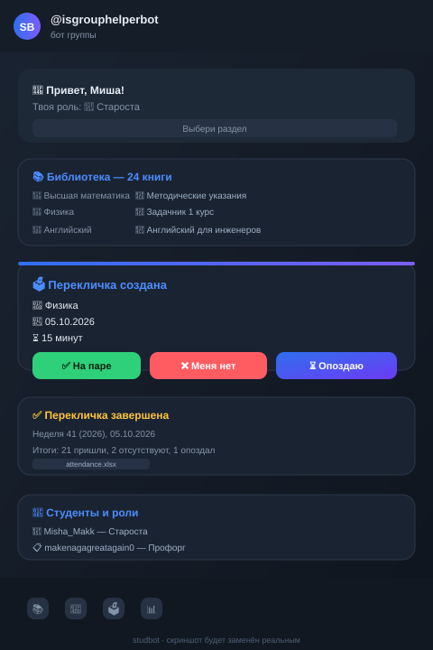
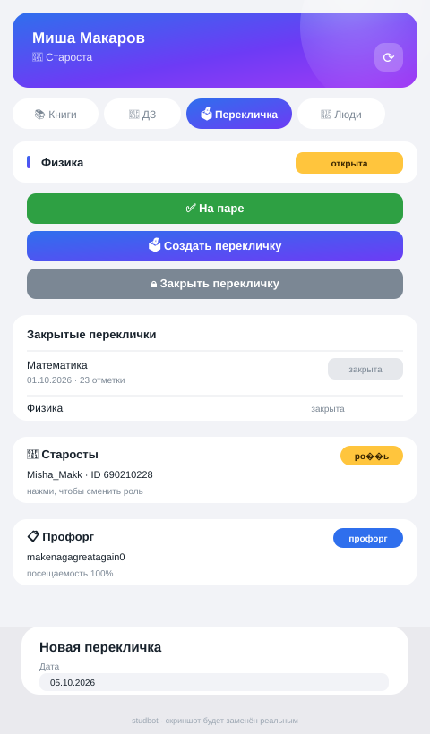
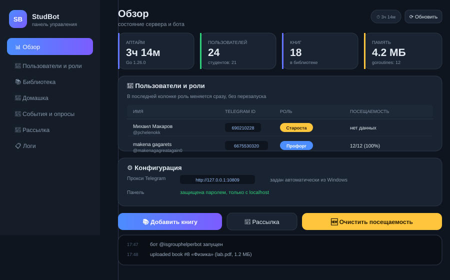

# StudBot

Telegram-бот для староста учебной группы: библиотека с файлами, домашние задания, перекличка через голосование с выгрузкой в Excel, опросы, события и веб-панель управления.

Написан на Go. Вся логика доступна и через команды в чате, и через Telegram Mini App.

<p align="center">
  
  
  
</p>

<p align="center"><sub>Макеты интерфейса. Реальные скриншоты будут поставлены позже.</sub></p>

---

## Возможности

### Библиотека книг
Книги по предметам с прикреплёнными файлами (PDF, DOCX, изображения). Староста загружает файл прямо в чат — бот сам спросит название, предмет и автора, сохранит файл и отдаст его по кнопке. Файлы можно скачать из чата или из мини-приложения.

### Домашние задания
Задания с дедлайнами, сгруппированные по предметам. Есть фильтр по предмету и удаление заданий.

### Перекличка через голосование
Вместо ручной отметки — голосование, которое делают сами студенты:

1. Староста или профорг пишет `/vote`
2. Бот спрашивает дату, длительность и предмет
3. Студенты отмечаются кнопками:
   - ✅ На паре
   - ❌ Меня нет
   - ⏳ Опоздаю, но на паре буду
4. Голосование закрывается автоматически по таймеру или досрочно — `/closevote <id>`
5. Старосте в личку приходит Excel с результатами

Голоса можно менять, пока перекличка открыта.

### Excel с посещаемостью
Один накопительный файл `attendance.xlsx`, который **дополняется** при каждой закрытой перекличке. Каждая неделя — отдельный лист (`Неделя 40 (2026)`, `Неделя 41 (2026)`). Колонки: дата, предмет, ФИО, Telegram, статус, время ответа.

Генератор `.xlsx` написан на стандартной библиотеке — никаких внешних зависимостей.

### Опросы и события
Опросы создаются по шагам, голосование кнопками прямо в чате с подсчётом результатов и процентов. События — календарь важных дат группы.

### Роли
| Роль | Права |
|---|---|
| 👑 **root** (староста) | Всё: управление контентом, переклички, назначение ролей, выгрузка таблиц |
| 📋 **proforg** (профорг) | Контент, переклички, выгрузка таблиц |
| 👤 **student** (студент) | Просмотр библиотеки, ДЗ и событий, голосование |

Роли назначаются по юзернейму — Telegram ID подставляется автоматически:

```
/setrole @makenagagreatagain0 proforg
```

### Мини-приложение
Весь функционал в Telegram Mini App: вкладки-капсулы, карточки книг с загрузкой файлов, перекличка с кнопками, управление ролями.

### Админ-панель
Локальная веб-панель для работы с ботом на своём компьютере:

- 📊 Обзор — аптайм, память, goroutines, размер базы, конфигурация
- 👥 Пользователи и роли — таблица со сменой роли прямо из панели
- 📚 Библиотека — загрузка книг с файлами (до 64 МБ)
- 📝 Домашка — задания по предметам
- 📅 События и опросы
- 📣 Рассылка — сообщение всем или только студентам
- 📋 Логи — журнал действий

Защищена паролем и ограничением по IP.

---

## Быстрый старт

### Требования

- Go 1.26 или новее
- Telegram-бот от [@BotFather](https://t.me/BotFather)

CGO не нужен — SQLite собирается на чистом Go.

### Установка

```bash
git clone https://github.com/ВАШ_НИК/studbot.git
cd studbot
go mod download
```

### Настройка

```bash
cp .env.example .env
```

Заполни `.env`:

```ini
BOT_TOKEN=123456:ABC-DEF...          # токен от BotFather
ROOT_USER_IDS=690210228              # твой Telegram ID — станешь старостой
ADMIN_PASSWORD=сложный_пароль         # пароль входа в админ-панель
WEBAPP_URL=https://example.com       # заполнится позже
```

Как узнать свой Telegram ID: напиши [@userinfobot](https://t.me/userinfobot).

### Запуск

```bash
go run ./cmd/bot
```

Бот сразу начнёт работать: команды, библиотека, переклички. Мини-приложение заработает после настройки туннеля.

---

## Мини-приложение

Telegram требует HTTPS-адрес с валидным сертификатом. Для локальной разработки подойдёт туннель.

### Cloudflare Tunnel (рекомендуется)

```bash
cloudflared tunnel --url http://localhost:8080
```

Выдаст адрес вида `https://random-word.trycloudflare.com`. Он бесплатный, не требует регистрации и не показывает заглушку с паролем.

### Привязка к боту

1. Скопируй полученный адрес в `WEBAPP_URL` в `.env`
2. Перезапусти бота — он сам поставит кнопку «Приложение» в меню
3. В [@BotFather](https://t.me/BotFather): `/setmenubutton` → выбери бота → приложение

> **Важно:** quick-туннель выдаёт новый адрес при каждом перезапуске. Для постоянного адреса нужен свой домен с Cloudflare Tunnel.

---

## Команды бота

### Контент

| Команда | Описание |
|---|---|
| `/books` | библиотека |
| `/homework` | домашние задания по предметам |
| `/polls` | активные опросы |
| `/events` | события |

### Перекличка

| Команда | Описание |
|---|---|
| `/vote` | создать перекличку (пошагово) |
| `/closevote <id>` | закрыть перекличку досрочно |
| `/table` | скачать таблицу посещаемости |
| `/table 40` | только за 40-ю неделю |
| `/table 40 2026` | конкретная неделя и год |
| `/stats` | статистика по студентам |

### Управление

| Команда | Описание |
|---|---|
| `/setrole @ник <роль>` | назначить роль (только староста) |
| `/menu` | главное меню |
| `/cancel` | отменить текущее действие |
| `/help` | справка |

---

## Админ-панель

По умолчанию доступна только с localhost:

```
http://127.0.0.1:8081
```

Вход по паролю из `ADMIN_PASSWORD`. Панель не отвечает на запросы из внешней сети, пока `ADMIN_ONLY_LOCAL=true`.

Если нужен доступ с телефона — пробрось порт по SSH:

```bash
ssh -L 8081:127.0.0.1:8081 user@your-pc
```

---

## Конфигурация

| Переменная | По умолчанию | Описание |
|---|---|---|
| `BOT_TOKEN` | — | токен бота (обязательно) |
| `ROOT_USER_IDS` | — | Telegram ID старост через запятую |
| `ADMIN_USER_IDS` | — | дополнительные администраторы |
| `PROFORG_USER_IDS` | — | профорги при старте |
| `ADMIN_PASSWORD` | — | пароль админ-панели |
| `ADMIN_ONLY_LOCAL` | `true` | пускать панель только с localhost |
| `ADMIN_ADDR` | `127.0.0.1:8081` | адрес панели |
| `WEBAPP_URL` | — | публичный HTTPS-адрес мини-приложения |
| `LISTEN_ADDR` | `:8080` | адрес веб-сервера |
| `PROXY_URL` | авто | прокси для Telegram |
| `DB_PATH` | `data/studbot.db` | файл базы |
| `UPLOAD_DIR` | `data/uploads` | загруженные файлы |
| `EXPORT_DIR` | `data/exports` | выгрузки Excel |

### Прокси

Бот сам читает системный прокси Windows из реестра (`Internet Settings`) и использует его для Telegram. Если нужно указать вручную — заполни `PROXY_URL`:

```ini
PROXY_URL=http://127.0.0.1:7890
```

Если Telegram недоступен напрямую, веб-сервер и админ-панель всё равно работают, а бот автоматически переподключается каждые 15 секунд.

---

## Структура проекта

```
studbot/
├── cmd/bot/                  точка входа
└── internal/
    ├── bot/                  логика Telegram
    │   ├── bot.go            подключение, апдейты, роли
    │   ├── commands.go       команды
    │   ├── callbacks.go      inline-кнопки
    │   ├── wizard.go         пошаговые сценарии, перекличка, Excel
    │   ├── keys.go           клавиатуры
    │   ├── table.go          выгрузка таблицы по запросу
    │   └── text.go           экранирование HTML
    ├── admin/                админ-панель (сервер + статика)
    ├── webapp/               мини-приложение (сервер + статика)
    ├── storage/              SQLite: пользователи, книги, ДЗ,
    │                         посещаемость, опросы, события, переклички
    ├── config/               конфиг и определение прокси
    ├── telegram/             HTTP-клиент Bot API
    ├── xlsx/                 генератор .xlsx без зависимостей
    └── filekind/             проверка типов файлов
```

Всё состояние — в одном файле SQLite. Скопируй `data/studbot.db`, и вся история переезжает с тобой.

---

## Разработка

```bash
go build ./...      # сборка
go vet ./...        # статический анализ
go test ./...       # тесты
gofmt -w ./cmd ./internal
```

35 тестов покрывают парсинг callback-данных, экранирование HTML, слой хранения, авторизацию панели и валидацию файлов.

---

## Безопасность

- Токен и пароль только в `.env`, который не попадает в git
- Экранирование пользовательского текста через `escHTML` — текст из чата не может сломать разметку сообщений
- Авторизация Mini App по HMAC-SHA256 с проверкой `auth_date`
- Админ-панель: пароль в HttpOnly-cookie плюс ограничение по IP
- Мини-приложение: строгий CSP, никаких inline-обработчиков

---

## Лицензия

MIT